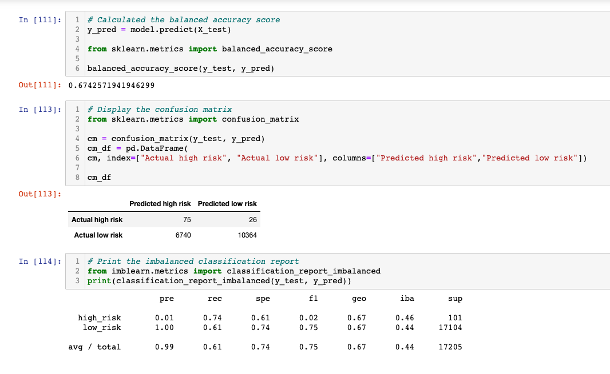
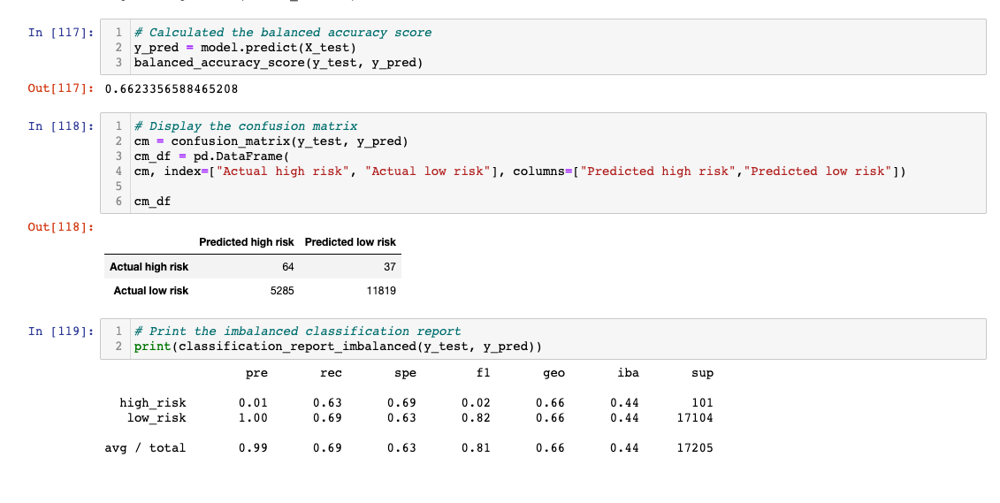
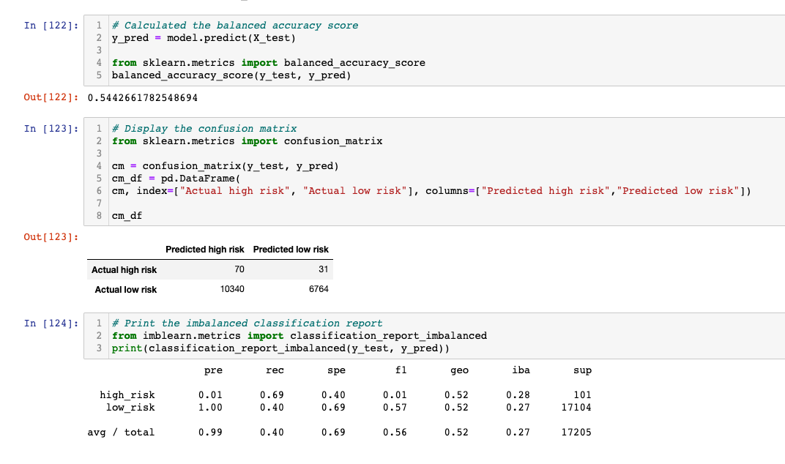
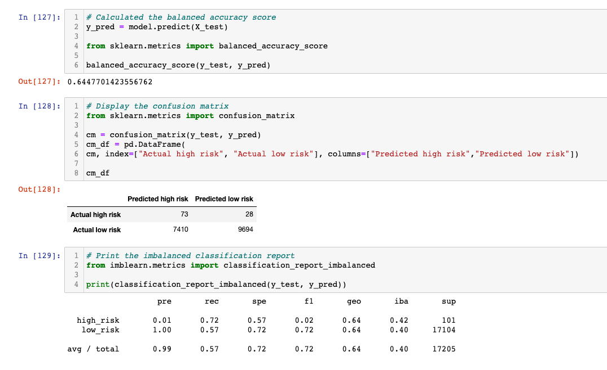
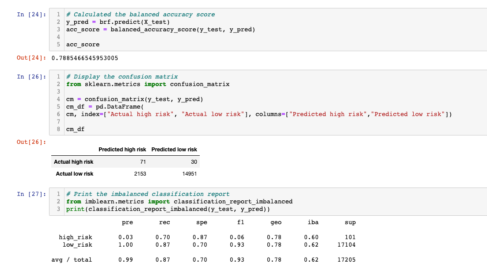
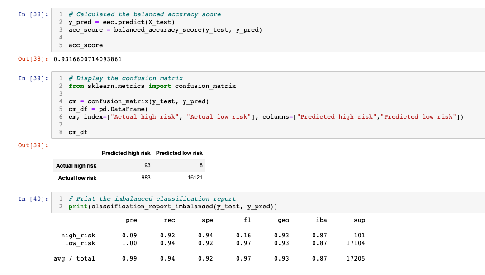

# Credit_Risk_Analysis

## Overview of Analysis
Using a credit card credit dataset from LendingClub, I performed six different machine learning algorithms with imbalanced-learn and scikit-learn libraries to determine which model is the most accurate (if any) to predict future credit risk. 

## Results
The six models I used are the following:
- Oversample with RandomOverSampler and SMOTE
- Undersample with ClusterCentroids
- Combinatorial approach of over- and undersampling with SMOTEEN
- Two new machine learning models, BalancedRandomForestClassifier and EasyEnsembleClassifier

### Naive Random Oversampling

- Accuracy score: 0.67
- F1 score for high_risk: 0.02
- Precision score for high_risk: 0.01
- Recall: 0.61

### SMOTE Oversampling

- Accuracy score: 0.66
- F1 score for high_risk: 0.02
- Precision score for high_risk: 0.01
- Recall: 0.69

### ClusterCentroids Undersampling

- Accuracy score: 0.54
- F1 score for high_risk: 0.01
- Precision score for high_risk: 0.01
- Recall: 0.40

### SMOTEENN

- Accuracy score: 0.64
- F1 score for high_risk: 0.01
- Precision score for high_risk: 0.02
- Recall: 0.57

### Balanced Random Forest Classifier

- Accuracy score: 0.79
- F1 score high_risk: 0.06
- Precision score for high_risk: 0.03
- Recall: 0.87

### Easy Ensemble AdaBoost Classifier

- Accuracy score: 0.93
- F1 score for high_risk: 0.16
- Precision score for high_risk: 0.09
- Recall: 0.94

## Summary
Summarize the results of the machine learning models, and include a recommendation on the model to use, if any. If you do not recommend any of the models, justify your reasoning.

When comparing all six machine learning models there are a couple of things that stick out:

1. The precision scores are the same for every model except the last two, Balanced Random Forest and Easy Ensemble. The precision score is very low for determining high risk borrowers but very high for deteremining low risk. This means there is a pronounced imbalance between sensitivity and precision. This also means most of these models measure low for how reliable a positive classification is.
2. The model with the lowest recall rate is ClusterCentroids undersampling.
3. The model with the highest accuracy score is Easy Ensemble while the model with the lowest accuracy score is the ClusterCentroids undersampling.
4. By just looking at the confusion matrix, I can determine that the Easy Ensemble Classifier produced the highest number of true positives, and smallest number of false positives, hence the higher accuracy score. 
5. By just looking at the confusion matrix, I can determine that the ClusterCentroids undersampling model produced the highest number of false positive results.

### My model recommendation
My recommendation on which model to use to best predict credit risk would be the Easy Ensemble Classifier model. Not only did this model produce the best accuracy score, but it also produced the highest recall rate meaning there are much fewer false negatives than in the other five models. The F1 score for high risk borrowers from the Easy Ensemble model is also the highest out of all the other models, meaning there is a better balance between sensitivity and precision compared to the other model's lower F1 scores. This model also has the highest precision rate out of all the other models. I don't have any further recommendations as the Easy Ensemble produced good results to predict credit risk for both high risk and low risk borrowers.
